# Telegram Bot in Go

Simple Telegram bot written in Go using Cobra and Telebot v4.

## Technologies

- Go
- Cobra
- Telebot v4
- Telegram Bot API

## Features

The bot supports:

- `/start` - start the bot
- `/help` - show available commands
- `/hello` - greeting
- text messages
- photos
- documents
- stickers

The bot also processes text message content.

Examples:

```text
hello
привіт
ping
golang
```

## Requirements

- Go 1.26 or newer
- Telegram Bot token

## Installation

Clone the repository:

```bash
git clone https://github.com/ekucher/kbot.git
cd kbot
```

Install dependencies:

```bash
go mod download
```

## Configuration

Create a Telegram bot using BotFather.

The bot uses the following environment variable:

TELE_TOKEN

The Telegram message handlers use `tele.Context`.

Set the Telegram token using the `TELE_TOKEN` environment variable.

### Windows PowerShell

```powershell
$env:TELE_TOKEN = "YOUR_BOT_TOKEN"
```

### Linux

```bash
export TELE_TOKEN="YOUR_BOT_TOKEN"
```

Do not store the Telegram Bot token in the source code or repository.

## Run

```bash
go run .
```

## Build

```bash
go build ./...
```

## Telegram Bot

https://t.me/ekucher_go_bot

## CI/CD Workflow

The `develop` branch is automatically built and deployed using GitHub Actions, GitHub Container Registry, Helm and Argo CD.

```mermaid
flowchart LR
    DEV[Developer] -->|git push develop| GH[GitHub Repository]
    GH --> GA[GitHub Actions]
    GA --> TEST[Go Test]
    TEST --> BUILD[Go Build]
    BUILD --> DOCKER[Docker Build linux/amd64]
    DOCKER --> GHCR[GitHub Container Registry]
    GHCR --> VALUES[Update Helm values.yaml]
    VALUES --> GIT[Commit deployment tag]
    GIT --> ARGO[Argo CD]
    ARGO --> K8S[Kubernetes]
    K8S --> KBOT[kbot Pod]
    KBOT --> TG[Telegram API]
```



Container image format:

```text
ghcr.io/ekucher/kbot:v1.0.0-<git-sha>-linux-amd64
```
